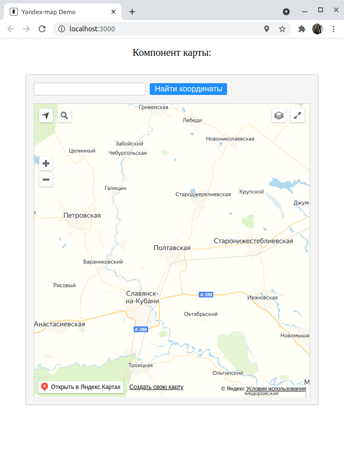
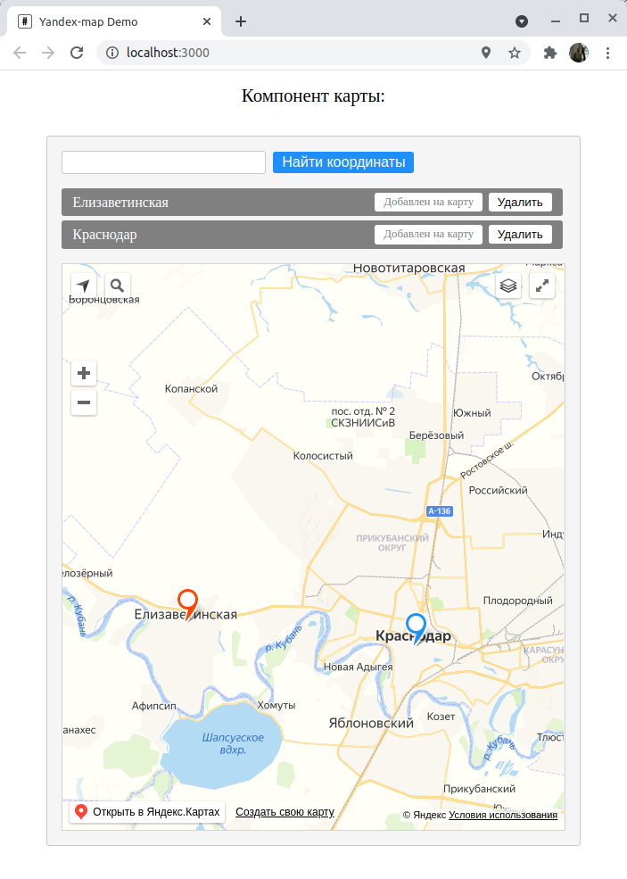

# yandex_map_demo
Небольшой проект для отработки приемов использования Яндекс-карт

Это не самостоятельное приложение, а лишь небольшое демо компонентов React, работающих с Яндекс-картой. Пользователь может вводить в строку поиска названия городов, поселков и т.д. и они будут добавляться в список и помечаться маркером на карте. При клике на названии местоположения в списке, карта автоматически прокручивается на него. Также местоположения (и соответствующие им маркеры на карте) можно удалять по щелчку на кнопку "Удалить".

Деплой проекта доступен [по ссылке](https://hproger.ru/yandex_map_demo/)

